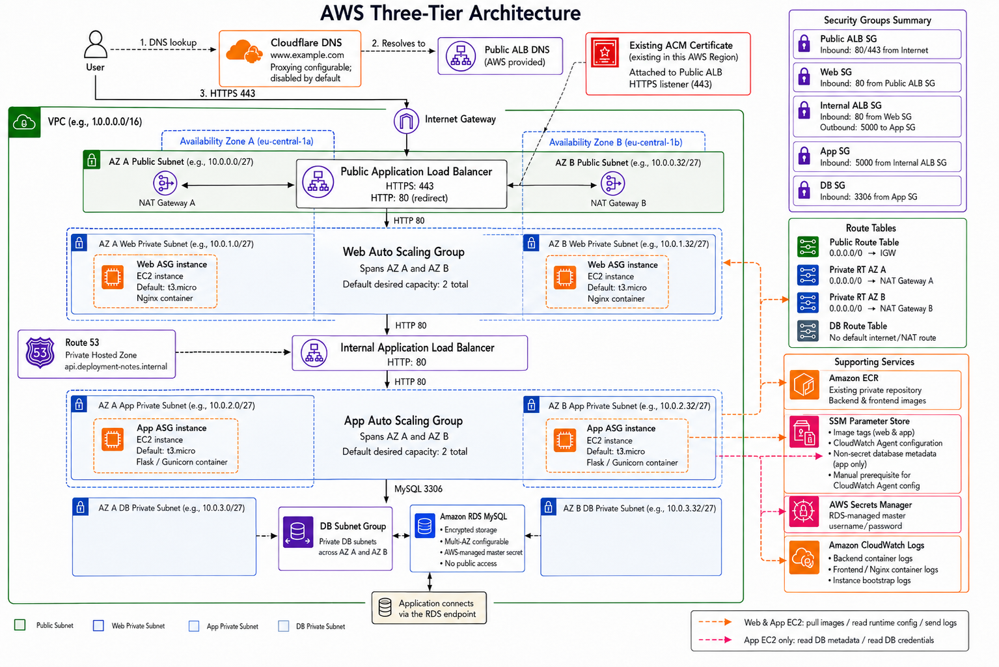

# AWS Three-Tier Architecture with Terraform

[](https://github.com/adelaspc/aws-3tier-architecture/actions/workflows/terraform-ci-cd.yml)
[](https://github.com/adelaspc/aws-3tier-architecture/actions/workflows/app-ci-cd.yml)


This repository provisions an AWS three-tier application environment with Terraform. It is designed as an ephemeral portfolio/demo stack: create the infrastructure, verify the architecture and deployment workflow, then destroy it to avoid ongoing AWS costs.

The sample workload is the `deployment-notes` application, a small Flask/Vue deployment tracking app deployed through EC2 Auto Scaling Groups, Application Load Balancers, Amazon RDS, ECR, SSM Parameter Store, and GitHub Actions.



## What This Project Demonstrates

- Modular Terraform for VPC, security groups, load balancers, compute, RDS, DNS, and GitHub Actions IAM.
- Multi-AZ AWS network layout with public, web, app, and database subnets.
- Public and internal Application Load Balancers.
- EC2 Launch Templates and Auto Scaling Groups for separate web and app tiers.
- Private RDS MySQL with encrypted storage and managed master password.
- S3 remote state bootstrap with native lockfile support.
- GitHub Actions OIDC roles for Terraform plan/apply and application deployment.
- Application releases through ECR images, SSM image tag parameters, database migrations, and ASG Instance Refresh.
- Explicit documentation of cost, security, and production-readiness trade-offs.

## Quality Gates

The badges at the top of this README show the latest GitHub Actions status for the Terraform and application pipelines. The Terraform workflow checks formatting, generated module documentation, module tests, validation, TFLint, Checkov, and pull request plans. The application workflow runs tests, builds images, pushes to ECR, runs migrations, and refreshes the EC2 Auto Scaling Groups.

For a local pre-flight check before opening a pull request:

```bash
pre-commit run --all-files
```

## Architecture Summary

Traffic enters through Cloudflare DNS and an internet-facing ALB. The web tier runs a containerized Nginx/Vue frontend on EC2 instances in private subnets. API traffic is proxied to an internal ALB, which forwards requests to a Flask/Gunicorn app tier. The app tier connects to a private RDS MySQL database.

High-level flow:

```text
User
  -> Cloudflare DNS
  -> Public ALB
  -> Web ASG in private subnets
  -> Internal ALB
  -> App ASG in private subnets
  -> RDS MySQL in isolated database subnets
```

See [docs/architecture.md](docs/architecture.md) for more detail.

## Quick Start

Prerequisites:

- Terraform `1.15.6`.
- AWS account and local AWS credentials for initial bootstrap.
- Existing ACM certificate in the same AWS region as the public ALB, covering the public application hostname.
- Cloudflare zone and API token for public DNS. If Cloudflare proxying is enabled, verify ACM validation and ALB hostname behavior before relying on the proxied record.
- Existing GitHub OIDC provider in AWS for `token.actions.githubusercontent.com`.
- Existing ECR repository for backend/frontend images. This repository is intentionally treated as a prerequisite, not managed by this Terraform stack.
- Initial application images, or a plan to run the app deployment workflow after infrastructure is ready.
- Runtime SSM parameters for CloudWatch agent config. Database connection metadata is published by Terraform; see [docs/operations.md](docs/operations.md).

Bootstrap remote state:

```bash
cd environments/backend-bootstrap
cp terraform.tfvars.example terraform.tfvars
terraform init
terraform apply
```

Configure and apply the dev environment:

```bash
cd ../dev
cp backend.hcl.example backend.hcl
cp terraform.tfvars.example terraform.tfvars
terraform init -backend-config=backend.hcl
terraform plan
terraform apply
```

When finished, destroy the demo stack to stop recurring charges:

```bash
terraform destroy
```

Keep the backend bootstrap stack separate from the dev stack so destroying the application does not delete the remote state bucket.

## GitHub Actions and CI/CD

The repository includes separate workflows for Terraform infrastructure and application deployments:

- Terraform CI/CD validates formatting, runs Terraform tests, TFLint, Checkov, and creates plans.
- Manual Terraform apply is gated through a GitHub Environment.
- Application CI/CD tests the app, builds Docker images, pushes to ECR, runs migrations through SSM, updates SSM image tag parameters, and triggers ASG Instance Refresh.

See [docs/ci-cd.md](docs/ci-cd.md) and [environments/github-actions-bootstrap/README.md](environments/github-actions-bootstrap/README.md).

## Deployment Workflow

Application deployment is intentionally separate from Terraform infrastructure changes. Terraform creates the shape of the infrastructure, while GitHub Actions controls image releases and instance replacement.

For application releases, the workflow updates backend/frontend image tag parameters in SSM Parameter Store and refreshes the web and app ASGs. For infrastructure changes that affect EC2 runtime configuration, run an Instance Refresh after `terraform apply`.

See [docs/demo-walkthrough.md](docs/demo-walkthrough.md) for an end-to-end reviewer flow and [docs/operations.md](docs/operations.md) for operational commands.

## Estimated Costs

This stack can generate meaningful AWS charges while running. Exact cost depends on region, runtime duration, traffic, and retained logs. The main recurring cost drivers are:

- NAT gateways.
- RDS MySQL, especially Multi-AZ.
- Public and internal ALBs.
- EC2 instances in both web and app ASGs.
- CloudWatch Logs ingestion and retention.

The intended demo lifecycle is short: provision, verify, then destroy.

## Cost-Conscious Choices

- Small default EC2 instance type.
- Small default RDS instance class.
- Short CloudWatch log retention.
- RDS deletion protection disabled by default for easy teardown.
- Final RDS snapshot skipped by default for disposable demo data.
- ALB access logs supported but disabled by default to reduce cost.
- VPC Flow Logs omitted by default to reduce cost.

These defaults are intentional for a portfolio demo and are not production recommendations.

## Intentional Trade-Offs

| Area | Demo choice | Production direction |
|---|---|---|
| Runtime secrets | RDS password is stored in the AWS-managed RDS master secret; Terraform publishes only non-secret DB metadata to SSM. | Keep secrets out of Terraform state and define a formal secrets bootstrap or rotation process. |
| Teardown safety | RDS deletion protection and final snapshot are disabled by default. | Enable deletion protection, final snapshots, and restore testing. |
| Network egress | Private subnets use NAT gateways for simpler AWS service access. | Add VPC endpoints for SSM, ECR, CloudWatch Logs, and S3 when the environment is long-lived. |
| Observability | Some optional logging and RDS Performance Insights are omitted by default. | Enable the appropriate logging, metrics, retention, alarms, and database observability profile. |
| Cost control | ALB access logs and VPC Flow Logs are disabled by default. | Enable audit logs with retention, lifecycle, and review processes. |

More detail: [docs/security-and-tradeoffs.md](docs/security-and-tradeoffs.md) and [docs/decisions.md](docs/decisions.md).

## Higher-Availability Choices That Increase Cost

- Multi-AZ subnet layout.
- Web and app ASGs spread across multiple AZs.
- Two NAT gateways.
- Separate public and internal ALBs.
- RDS Multi-AZ support.

These choices make the architecture more realistic, but they increase the cost of leaving the stack running.

## Repository Structure

```text
.
|-- environments/
|   |-- backend-bootstrap/       # Remote state S3 bucket bootstrap
|   |-- github-actions-bootstrap/# GitHub OIDC IAM roles
|   |-- dev/                     # Composed dev environment
|   `-- modules/                 # Reusable Terraform modules
|-- deployment-notes/            # Sample Flask/Vue application
|-- .github/workflows/           # Terraform and app CI/CD workflows
|-- scripts/                     # Operational helper scripts
|-- docs/                        # Detailed architecture and operations docs
`-- Architecture.png             # Architecture diagram
```

## Documentation

- [Architecture](docs/architecture.md)
- [Infrastructure](docs/infrastructure.md)
- [Bootstrap](docs/bootstrap.md)
- [Demo walkthrough](docs/demo-walkthrough.md)
- [CI/CD](docs/ci-cd.md)
- [Operations](docs/operations.md)
- [Recovery](docs/recovery.md)
- [Troubleshooting](docs/troubleshooting.md)
- [Security and trade-offs](docs/security-and-tradeoffs.md)
- [Design decisions](docs/decisions.md)
- [Deployment Notes app](deployment-notes/README.md)
- Generated Terraform references:
  - [Dev environment](environments/dev/README.md)
  - [VPC module](environments/modules/vpc/README.md)
  - [Security groups module](environments/modules/security_groups/README.md)
  - [Load balancers module](environments/modules/load_balancers/README.md)
  - [Compute module](environments/modules/compute/README.md)
  - [RDS module](environments/modules/rds/README.md)
  - [DNS module](environments/modules/dns/README.md)
  - [GitHub Actions IAM module](environments/modules/github-actions-iam/README.md)

## Current Limitations

- This is an ephemeral demo stack, not a production environment.
- Runtime SSM parameters for CloudWatch agent configuration are created manually.
- The ECR repository is expected to exist before deployment and is not created by Terraform.
- The public application requires an existing ACM certificate.
- The app deployment workflow assumes GitHub variables and environments are configured after IAM bootstrap.
- Some logging, backup, and retention controls are relaxed to keep teardown simple and cost low.

## Future Improvements

- Terraform-managed CloudWatch agent SSM bootstrap.
- Optional VPC endpoints for SSM, ECR, CloudWatch Logs, and S3.
- Optional VPC Flow Logs.
- Infracost estimate and cost examples by region.
- Source file for the architecture diagram.
- Additional environment separation for staging or production-style deployments.
