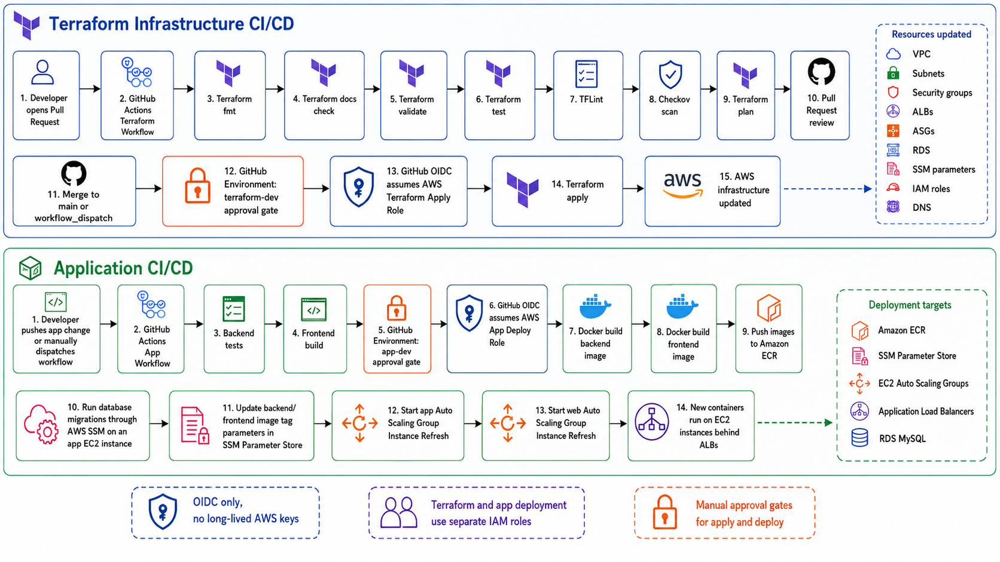

# CI/CD

The repository uses GitHub Actions for both infrastructure validation and application deployment.



## Terraform Workflow

The Terraform workflow validates infrastructure changes before apply:

- Terraform formatting check.
- Terraform module tests for GitHub Actions IAM boundaries.
- TFLint.
- Checkov.
- Terraform validation.
- Pull request plan for trusted internal PRs.
- Manual apply from `main` through the `terraform-dev` GitHub Environment.

Terraform applies are intentionally manual and environment-gated.

Terraform job summaries expose only the successful result and aggregate change
counts. They do not include resource values or the full plan. The complete text
plan is retained as a workflow artifact for seven days and can be downloaded by
signed-in readers when the repository is public.

Existing setup notes: [../.github/terraform-ci-cd.md](../.github/terraform-ci-cd.md)

## Application Workflow

The application workflow:

1. Runs backend tests.
2. Builds the frontend.
3. Builds backend and frontend Docker images.
4. Pushes images to ECR.
5. Runs database migrations through SSM on an app-tier instance.
6. Updates SSM image tag parameters.
7. Starts ASG Instance Refresh for the app and web tiers.

The deployment role is assumed through GitHub OIDC and the `app-dev` GitHub Environment.

## Required GitHub Configuration

### Repository Variables

| Variable | Used by | Source |
|---|---|---|
| `AWS_REGION` | Terraform and app workflows | `terraform -chdir=environments/github-actions-bootstrap output github_actions_repository_variables` |
| `ECR_REPOSITORY` | App workflow | Existing ECR repository name; keep aligned with `ecr_repository_name` in Terraform |
| `AWS_TERRAFORM_PLAN_ROLE_ARN` | Terraform plan | `github_actions_repository_variables` output |
| `AWS_TERRAFORM_APPLY_ROLE_ARN` | Terraform apply | `github_actions_repository_variables` output |
| `AWS_APP_DEPLOY_ROLE_ARN` | App deployment | `github_actions_repository_variables` output |
| `TF_STATE_BUCKET` | Terraform workflow | `github_actions_repository_variables` output |
| `TF_STATE_KEY` | Terraform workflow | `github_actions_repository_variables` output |
| `APP_ASG_NAME` | App deployment | `terraform -chdir=environments/dev output github_actions_app_variables` |
| `WEB_ASG_NAME` | App deployment | `github_actions_app_variables` output |
| `BACKEND_IMAGE_TAG_PARAMETER_NAME` | App deployment | `github_actions_app_variables` output |
| `FRONTEND_IMAGE_TAG_PARAMETER_NAME` | App deployment | `github_actions_app_variables` output |
| `DATABASE_CONFIG_PARAMETER_NAME` | App deployment | `github_actions_app_variables` output |
| `BACKEND_CONTAINER_NAME` | App deployment | `github_actions_app_variables` output |

Bootstrap IAM outputs:

```bash
terraform -chdir=environments/github-actions-bootstrap output github_actions_repository_variables
```

Dev environment outputs:

```bash
terraform -chdir=environments/dev output github_actions_app_variables
```

### Repository or Environment Secrets

| Secret | Used by | Notes |
|---|---|---|
| `CLOUDFLARE_API_TOKEN` | Terraform plan/apply | Use a token scoped to the required Cloudflare zone and DNS permissions. |
| `TF_VARS_JSON` | Terraform plan/apply | JSON representation of sensitive or environment-specific Terraform variables that should not be committed. |

Prefer GitHub Environments for apply/deploy secrets when reviewer approval or branch protection should gate production-like operations.

### GitHub Environments

Create these GitHub Environments:

| Environment | Used by | Purpose |
|---|---|---|
| `terraform-dev` | Terraform apply | Manual infrastructure apply gate. |
| `app-dev` | Application deploy | Application release gate and deployment role assumption. |

## Security Model

The workflows use GitHub OIDC instead of static AWS access keys. Plan, apply, and app deploy have separate IAM roles. Apply and deploy are bound to GitHub Environments so branch rules and reviewer gates can be enforced outside Terraform.
