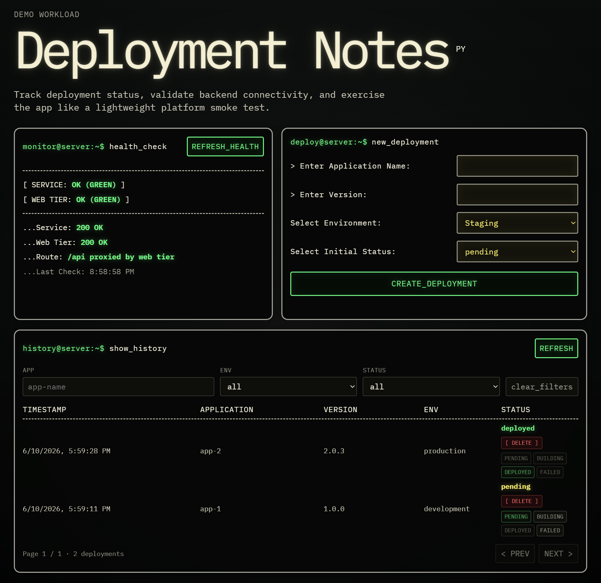

# Demo Walkthrough

This walkthrough is the shortest path for a reviewer to understand, deploy, verify, and destroy the portfolio environment.

## 1. Review the Architecture

Start with:

- [README.md](../README.md)
- [architecture.md](architecture.md)
- [security-and-tradeoffs.md](security-and-tradeoffs.md)
- [decisions.md](decisions.md)

The stack provisions a three-tier AWS application environment:

```text
Cloudflare DNS
  -> public Application Load Balancer
  -> private web Auto Scaling Group
  -> internal Application Load Balancer
  -> private app Auto Scaling Group
  -> private RDS MySQL
```

## 2. Run Local Quality Checks

Install the documented local tooling, then run:

```bash
pre-commit run --all-files
```

The hooks run Terraform formatting, Terraform validation/tests, generated documentation checks, TFLint, and Checkov.

## 3. Bootstrap Remote State

Create the backend resources once:

```bash
cd environments/backend-bootstrap
cp terraform.tfvars.example terraform.tfvars
terraform init
terraform apply
```

Use the outputs to create `environments/dev/backend.hcl`.

## 4. Bootstrap GitHub Actions IAM

Create the GitHub OIDC roles used by CI/CD:

```bash
cd ../github-actions-bootstrap
cp terraform.tfvars.example terraform.tfvars
terraform init
terraform apply
terraform output github_actions_repository_variables
```

Copy the output values into GitHub repository variables. See [ci-cd.md](ci-cd.md) for the full variable and secret list.

## 5. Configure the Manual Runtime Parameters

Before launching the EC2 instances, create the two CloudWatch agent configuration parameters documented in [operations.md](operations.md). Terraform creates the image-tag parameters and the non-secret database configuration parameter during the dev apply; do not create those manually.

The default CloudWatch agent parameter names are:

```text
/dev/deployment-app/cloudwatch-agent/backend
/dev/deployment-app/cloudwatch-agent/frontend
```

Create them before the next step so instance user data can complete successfully on first boot.

## 6. Deploy the Dev Environment

Apply the composed dev environment:

```bash
cd ../dev
cp terraform.tfvars.example terraform.tfvars
terraform init -backend-config=backend.hcl
terraform plan
terraform apply
terraform output github_actions_app_variables
```

Copy the app output values into GitHub repository or environment variables.

## 7. Verify Runtime Configuration

Terraform manages the image tag parameters and the non-secret database config parameter. The RDS password stays in the AWS-managed RDS master user secret. Confirm that these resources and the manually created CloudWatch agent parameters are present before continuing.

Useful outputs:

```bash
terraform -chdir=environments/dev output database_config_parameter_name
terraform -chdir=environments/dev output backend_image_tag_parameter_name
terraform -chdir=environments/dev output frontend_image_tag_parameter_name
```

## 8. Run the Application Deployment Workflow

Trigger the application workflow from GitHub Actions after infrastructure is ready. The workflow builds images, pushes to ECR, runs migrations through SSM, updates image tag parameters, and refreshes the app and web ASGs.

Verify the public endpoint:

```bash
curl https://<public-application-url>/health
curl https://<public-application-url>/app-health
```

The deployed demo workload is documented in [deployment-notes/README.md](../deployment-notes/README.md). It is intentionally a simple application used to validate the infrastructure and deployment pipeline, not a production-ready application.



## 9. Verify AWS Resources

Recommended checks:

```bash
aws autoscaling describe-auto-scaling-groups \
  --auto-scaling-group-names "<asg-name>" \
  --query "AutoScalingGroups[0].Instances[*].[InstanceId,LifecycleState,HealthStatus]" \
  --output table

aws elbv2 describe-target-health \
  --target-group-arn "<target-group-arn>"

aws logs describe-log-groups \
  --log-group-name-prefix "/dev/deployment-notes"
```

## 10. Destroy the Demo

Destroy the application environment when the review/demo is finished:

```bash
cd environments/dev
terraform destroy
```

Keep `backend-bootstrap` separate unless you intentionally want to retire the remote state bucket. State locking uses native S3 lockfiles; this project does not create a DynamoDB lock table.
